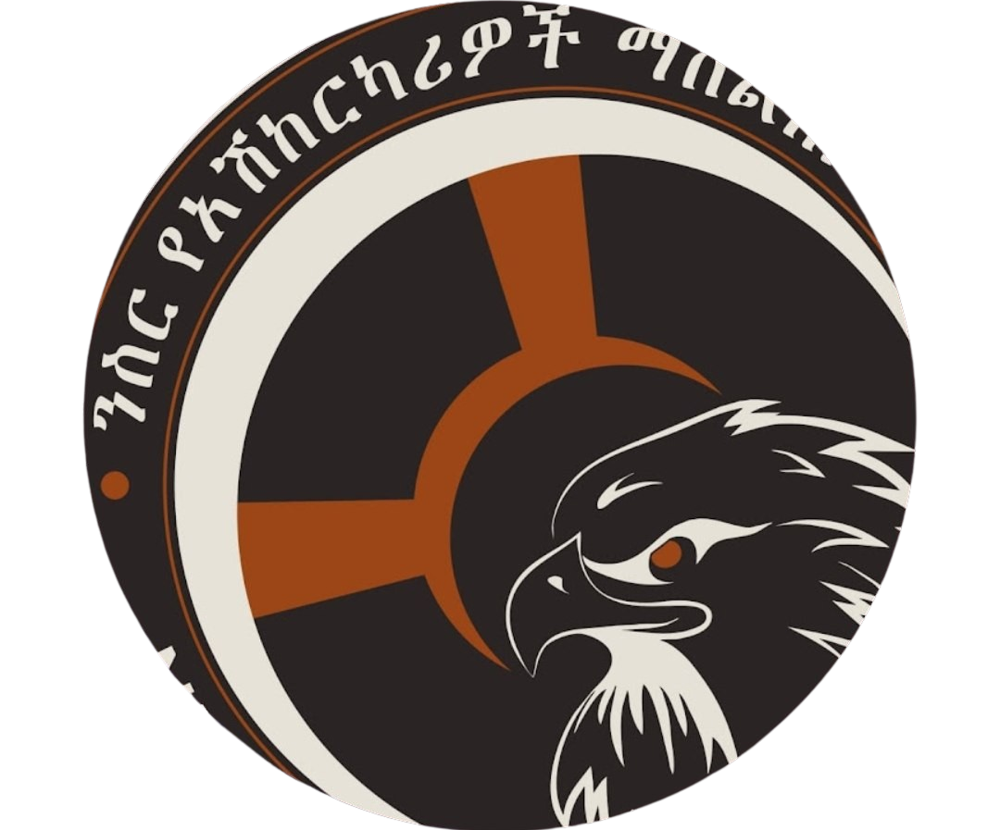

<div align="center">
  
  
  # Nesir Driving Center Student Registration System
  
  [](https://opensource.org/licenses/MIT)
  [](https://dotnet.microsoft.com/download)
  [](https://www.mysql.com/)

  **A comprehensive C# WinForms application for managing student registrations, payments, and training schedules at Nesir Driving Center.**
</div>

---

## 📖 About
Nesir Driving Center Student Registration System is a robust desktop application designed to streamline the administrative tasks of a driving school. It provides a centralized platform for managing student information, tracking payment histories, and monitoring training progress.

### Core Features
- **Student Enrollment**: Simplified form for registering new students with personal and training details.
- **Dashboard**: A high-level overview of all enrollees with quick search and filter capabilities.
- **Payment Management**: Track paid amounts, pending balances, and payment methods (Bank, Card, Online, Cash).
- **Training Schedules**: Manage different training packages (Auto-Mobile, Cargo 1, Public 1) and durations.
- **Reporting**: Generate detailed reports based on student status and training dates.
- **Secure Login**: Access control for administrative staff.

## 🛠️ Tech Stack
- **Language**: C#
- **Framework**: WinForms (.NET 8.0)
- **Database**: MySQL / MariaDB
- **Data Access**: `MySql.Data` & `Microsoft.Data.SqlClient`

## 🚀 Getting Started

### Prerequisites
- [.NET 8.0 SDK](https://dotnet.microsoft.com/en-us/download/dotnet/8.0)
- [MySQL Server](https://dev.mysql.com/downloads/installer/)

### Installation
1. **Clone the repository**:
   ```bash
   git clone https://github.com/NathanTura/NesirDrivingCenterStudentRegistration.git
   ```
2. **Setup Database**:
   - Create a database named `NesirDrivingCenter`.
   - Execute the stored procedures found in the database scripts (if provided) or ensure the tables `STUDENTINFO`, `PAYMENT`, `TRAINING`, `ADDRESSES`, and `USERSLIST` are created.
3. **Configure Connection**:
   - Update the `connectionString` variable in `MainMenu.cs`, `Form1.Designer.cs`, and `AddEnrollee.cs` with your database credentials.
4. **Build and Run**:
   ```bash
   dotnet build
   dotnet run --project NesirDrivingCenter
   ```

## 📸 Screenshots
*(Coming soon - please check the resources folder for UI assets)*

## 📄 License
This project is licensed under the MIT License - see the [LICENSE](LICENSE) file for details.

---
<div align="center">
  Developed by <b>Nathan Tura</b>
</div>
